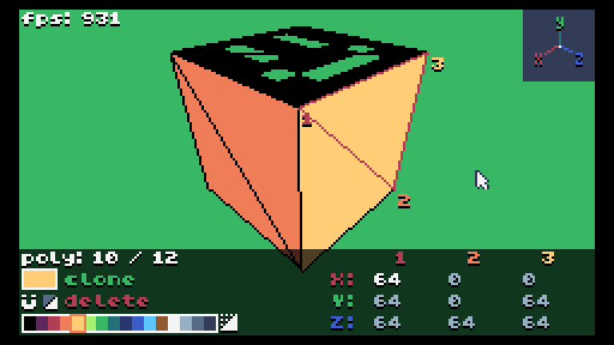

# BlenTIC

[BlenTIC](https://tic80.com/play?cart=2709) is a tool by [HanamileH](https://tic80.com/dev?id=2749) for creating 3D models (including textures) in TIC-80. This documentation was written by [soxfox42](https://soxfox.me/).

Check out the [interface overview](interface.md) to get started!

## Output

By default, BlenTIC outputs models in the format that is used by UniTIC, but this can be manually adjusted in the part of the code that is responsible for text output (search for the word "trace")

The model is output to the console automatically (several times per second), so make sure that you are using a recent version of TIC-80 in which you you can copy text from the console.

## Details

BlenTIC is backward compatible with versions up to 1.0, which should be automatically enabled (if this does not happen, feel free to look into the code) so it should work equally well on almost any versions.

BlenTIC is based on a 3D engine, UniTIC, which has been slightly modified in BlenTIC. Due to the modifications, BlenTIC generally has ~5-10% less FPS than UniTIC (useful to understand if you have added too many polygons to the scene).

