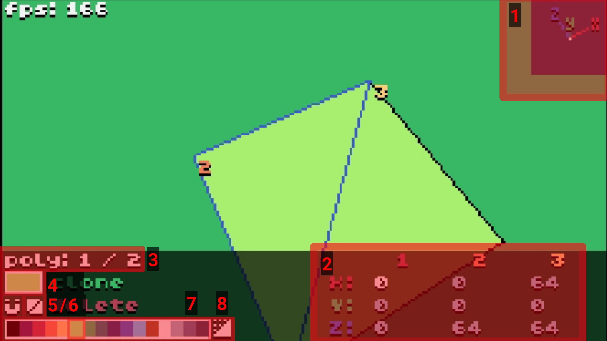

# Interface Overview

To rotate the camera, click and drag in the 3D display area.
To move the camera, use WASD, ctrl (down), and space (up).

## 1. XYZ pointer
Shows the direction of the three axes according to the current camera orientation.
To change the appearance or disable it entirely, click on it (this will cycle through display modes).

## 2. Coordinate editor
Used to view and edit the coordinates of the three points of the selected polygon. To edit a coordinate, click and drag the number.
To move the entire polygon along the axes, click and drag the letter X, Y or Z.

## 3. Selected polygon
Shows the ID of the selected polygon and the number of polygons in the scene.
To select a polygon, press page up / page down or double-click on the desired polygon.

## 4. Colour preview
Displays the colour of the selected polygon.
Click on it to enter the [texture editor](texture.md).

## 5. Snap control
Controls snapping of coordinates. There are three modes, indicated by the colour of the magnet icon, and they can be cycled through by clicking the magnet. To adjust the snap value, right click on the magnet, and adjust it with the arrows.

Global Snap (white)
: the coordinate will be rounded to an exact multiple of the current snap value.

Local Snap (green)
: the coordinate can only be moved by multiples of the snap value, but may be "off-grid" relative to the global snap.

No Snap (grey)
: the coordinate can be freely adjusted to any value.

Snapping only applies to a coordinate value that is currently being edited, so enabling it will not automatically adjust all shapes.

## 6. Face culling mode
Controls which faces of the polygon will be displayed. Click to cycle through displaying one face, the other face, and then both faces.

## 7. Colour palette
Displays the current colour palette and allows changing polygon colours. Click on one of the colours to set the current polygon's colour.

## 8. Cube generator
Opens a menu where you can quickly create a cube (or a rectangular prism).
