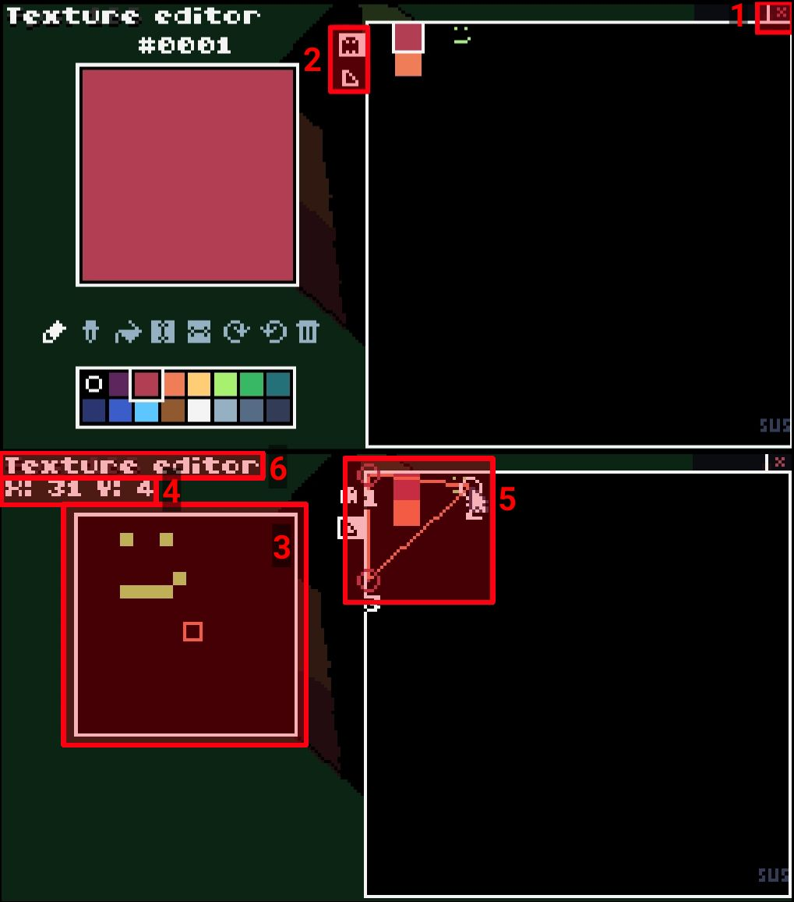

# Texture Editor

## 1. Exit button
Click this to return to the main editor screen.

## 2. Mode tabs
There are two editing modes in the texture editor - sprite editing, and UV editing.
The sprite editor functions basically the same as the standard TIC-80 sprite editor.
The UV editor allows you to select a region of the spritesheet to display on the triangle.

## 3. Sprite minimap
Shows the area of the spritesheet around the cursor.

## 4. Cursor coordinates
Displays the current cursor position.

## 5. Polygon texture points
The points here indicate the area of the spritesheet that will be drawn on the triangle.
They can be dragged around to adjust the mapping.

## 6. Editor name
Pretty self explanatory.

